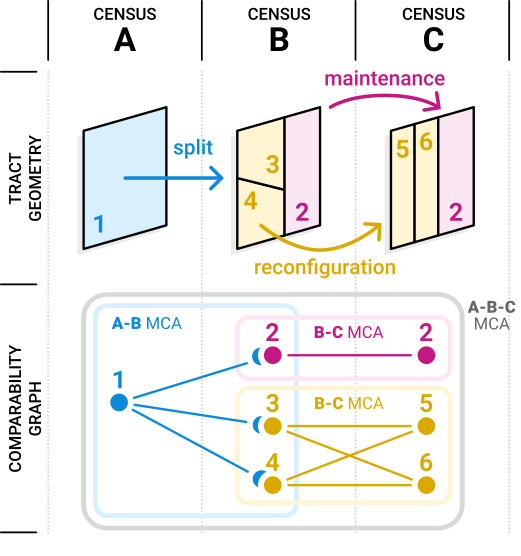
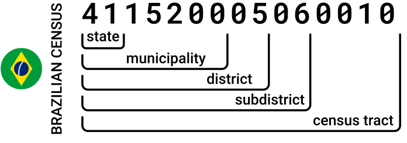
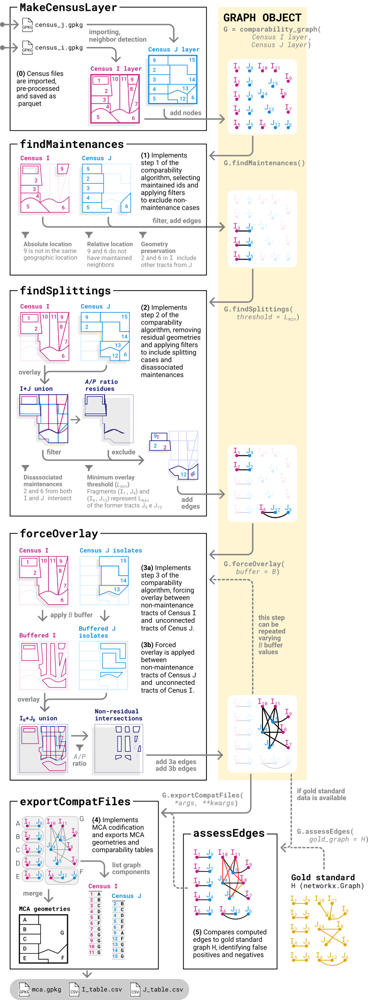

# CensusCompare: An algorithm to make geospatial coverage layers comparable

  

Urban analysis often relies on census or census-like survey data, but the redesign of census tract layers through time usually breaks historical comparability, hampering longitudinal studies at the local scale. This repository implements a comparability algorithm to make such layers comparable.

## Installation
To use this repository, clone it locally and install requiremets.txt to your environment.

## Overview
Our comparability algorithm has an additive heuristic, applying only sum and merge operations. In doing so, we avoid splitting tracts into multiple fragments, which would then require additional criteria to realocate demographic data. We rely only on tract geometry and official tract indexing to reconstruct the original redesign operations.


### Redesign operations and MCAs
A redesign operation is the process where the tracts covering a geographic region are redrawn and/or reindexed. We cathegorize such operations in four groups:

- Maintenance (`1:1`): when a tract does not change beween censuses
- Splitting (`1:n`): when a tract is split into multiple tracts
- Merge (`n:1`): when multiple tracts are merged into a single tract
- Reconfiguration (`m:n`): when multiple tracts are reconfigured to a different set of new tracts

Notice that all these operations can be represented as a bipartite graph, where nodes represent single tracts from both censuses and edges represent an existing redesign operation shared between two tracts. By identifying all redesign operations, we construct a graph which every component represents a minimum comparable geographic region between censuses. We call these components Minimum Comparable Areas (MCAs), following the terminology found in literature.

The image below shows a conceptual diagram of tract redesign operations across census A, B and C, and their abstraction into a comparability graph. Relationship between pairs of censuses form A-B and B-C census MCAs, and the whole period forms a single A-B-C MCA.



### Tract indexing
Most surveys and national censuses use a structured, hierarchical id to index spatial divisions. For example, the Brazilian Census adopts this census tract id structure:



This structure allows us to filter out redesign operations that involve tracts with different higher hierarchy parents. For example, we know that, in São Paulo Metropolitan Region, no municipality underwent a subdistrict redesign or reindexing between 2010 and 2022 censuses. Therefore, we can assure that all tracts involved in a redesign operation between these censuses must have the same first 11 digits in their ids.


### How the algorithm works

The diagram below shows the three core steps of our comparability algorithm (findMaintenances, findSplittings, forceOverlay) and other operational steps. The yellow column shows the objects and methods as implemented in our `utils.py` module. Our base object is inherited from `networkx.Graph`.




## Basic usage
Basic use examples are available as Jupyter Notebook files at the root directory. The usual comparability routine follows:

```python
# Census layer creation
layer_2010 = makeCensusLayer('resources/ibge/Setores IBGE.gpkg',
                            id_column='CD_GEOCODI')
layer_2022 = makeCensusLayer('resources/ibge/Setores IBGE.gpkg', 
                            id_column='CD_SETOR')

# Create comparability graph
G_compat = comparability_graph(layer_2010, layer_2022)

# Run comparability algorithm steps
G_compat.findMaintenances()
G_compat.findSplitings(threshold=0.8)

# Uses multiple buffers iteratively
for b in [-20, -10]:
    G_compat.forceOverlay(buffer=b)

# Overlays remaining tracts
G_compat.forceOverlay(buffer=0, use_all=True)

# Assesses the resulting edges
truth_graph = nx.Graph()
truth_graph.add_nodes_from(G_compat.nodes())
for _, r in ground_comparability_dataframe.iterrows():
    truth_graph.add_edge(f"A.{r['GEOCODIGO_2010']}", f"B.{r['GEOCODIGO_2022_PRELIMINAR']}")
G_compat.assessEdges(ground_truth_graph=truth_graph)

# Reports the results and exports the comparability files
G_compat.exportCompatFiles(BASENAME, NAME_C1, NAME_C2)
G_compat.reportCompat(file=f'results/{BASENAME}_report')
```

The `compat_od_rmsp.ipynb` file shows an example of recursive comparability, using Origin-Destination survey layers for multiple years.

## Classes and methods

### `makeCensusLayer` *(function)*

```python
makeCensusLayer(gpkg_file, 
                id_column,
                layer=None, 
                filter=[], 
                len_higher_hierarchy=11, 
                is_utm=False, 
                geosys='WGS84')
```
Reads a geopackage file, prepares it for the comparability algorithm and returns a `geopandas.GeoDataFrame` object. We recomend saving the result to parquet, as this operation is time consuming and returns a reusable data structure.
- **gpkg_file**: the path of a geopackage file containing the tracts
- **id_column**: the name of the column of the geopackage file containing the structured tract id
- **layer**: if the geopackage file contains layers, specify the name of the correct layer
- **filter**: a list of ids of all higher hierarchical level to be filtered in. If not specified, all tracts will be included
- **len_higher_hierarchy**: the maximum length of the id structure to which hierarchical coherence should be enforced (see Tract indexing section above for details)
- **is_utm**: boolean specifying if the input geopackage already uses an UTM projection. If False, the layer will be reprojected to a WGS84 UTM fuse, as the comparability algorithm uses metric operations
- **geosys**: accepts ('WGS84'|'SIRGAS2000'), specifying which datum to use

### `comparability_graph` *(class)*
```python
comparability_graph(m1, m2, ap_ratio=0.3)
```
Returns a comparability graph object from `geopandas.GeoDataFrame` layers m1 and m2. Both layers must be pre-processed with `makeCensusLayer`.
- **ap_ratio**: the `A/P` ratio parameter for residual geometry filtering


### `comparability_graph.findMaintenances` *(method)*
```python
comparability_graph.findMaintenances()
```
Identifies maintenance redesign operations and adds them to the comparability graph.

### `comparability_graph.findSplitings` *(method)*
```python
comparability_graph.findSplitings()
```
Identifies splitting redesign operations and adds them to the comparability graph.

### `comparability_graph.forceOverlay` *(method)*
```python
comparability_graph.forceOverlay(buffer, use_all=False)
```
Forces overlay between the two census layers and adds the resulting relationships to the comparability graph.
- **buffer**: float specifying the buffer parameter in meters, usually a negative number
- **use_all**: boolean specifying if all tracts must be included in the overlay. If False, only tracts represented by unconnected nodes will be considered

### `comparability_graph.assessEdges` *(method)*
```python
comparability_graph.assessEdges(ground_truth_graph)
```
Assesses the current edges of a comparability graph using ground truth data (ground_truth_graph), passed as a `networkx.Graph` object. The nodes of ground_truth_graph must be named exactly as in the comparability graph: ```f'{A|B}.{tract_id}```. The first bracket of the f-string specifies the census (A for m1, B for m2), and the second bracket is the tract id.

### `comparability_graph.reportCompat` *(method)*
```python
comparability_graph.reportCompat(file=None)
```
Returns a report of the current comparability_graph.
- **file**: a path to save the report. If None, the report will only be printed

### `comparability_graph.exportCompatFiles` *(method)*
```python
comparability_graph.exportCompatFiles(compatName,
                                      name_C1,
                                      name_C2, 
                                      mca_base='B', 
                                      dir='results')
```
Exports the comparability tables as .csv files and the MCA as geospatial layers of a .geopackage file.
- **compatName**: name of the comparability operation, used as prefix in the filenames
- **name_C1**: name of the first census layer, used as infix in the filenames
- **name_C2**: name of the second census layer, used as infix in the filenames
- **mca_base**: the base census layer for creating the MCA geopackage, accepts 'A' for m1 or 'B' for m2
- **dir**: the directory where the files should be saved

## Credits
#### Contributors
Pedro H. Rezende Mendonça, Fabio Kon

#### Acknowledgements
LabCidade FAUUSP, Instituto Peregum

#### Funding
FAPESP 2024/12863-8, FAPESP 2023/12851-7, FAPESP 2023/00811-0, FUSP 2025 - Edital Mudanças Climáticas

## Related works
R. MENDONÇA, Pedro H.; KON, Fabio. Compatibilização de setores censitários baseada em grafos para análise histórica de processos urbanos em escala local. In: WORKSHOP DE COMPUTAÇÃO URBANA (COURB), 9. , 2025, Natal/RN. Anais [...]. Porto Alegre: Sociedade Brasileira de Computação, 2025 . p. 29-42. ISSN 2595-2706. DOI: https://doi.org/10.5753/courb.2025.7950.

